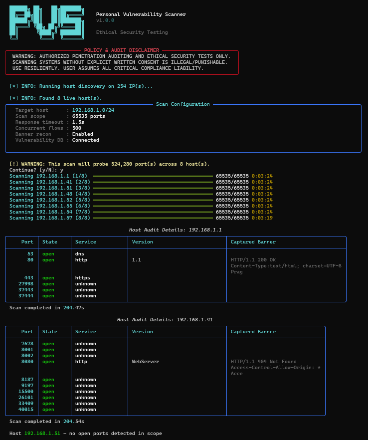
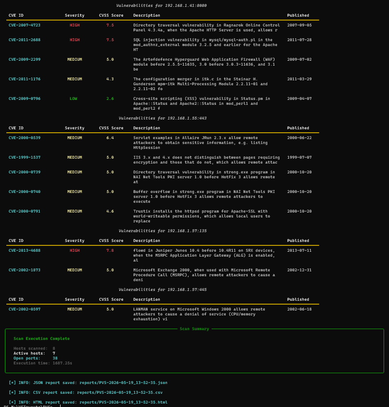
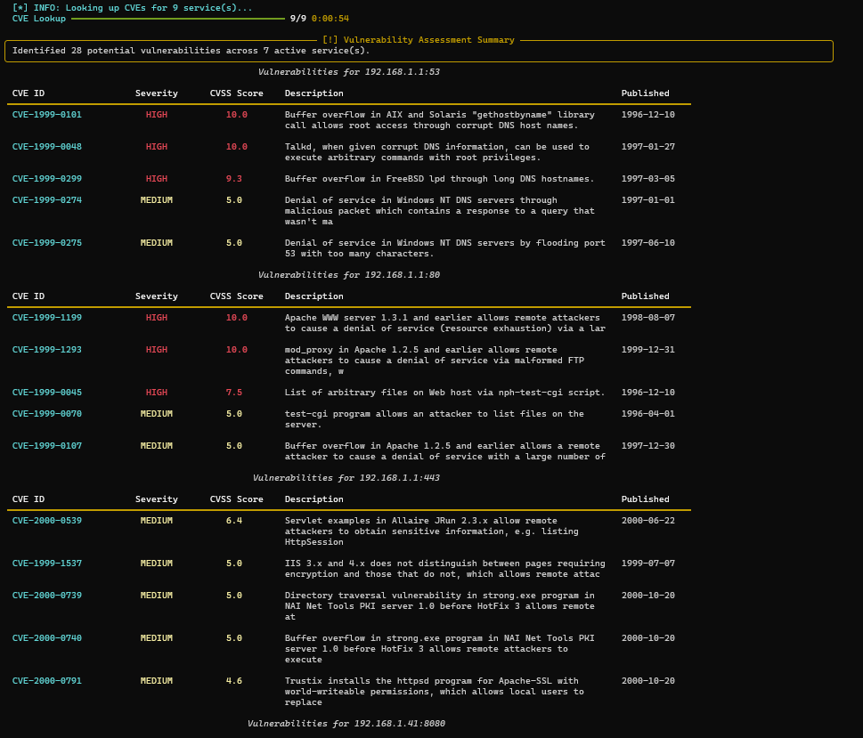
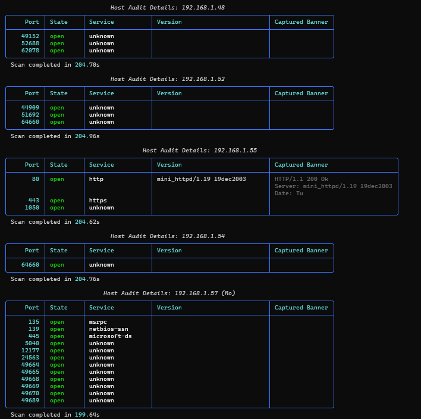
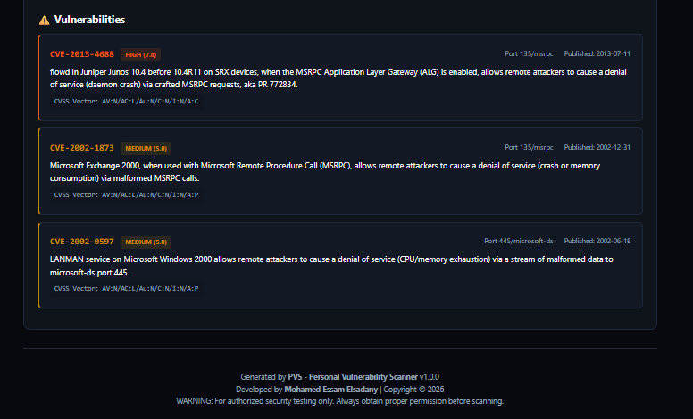
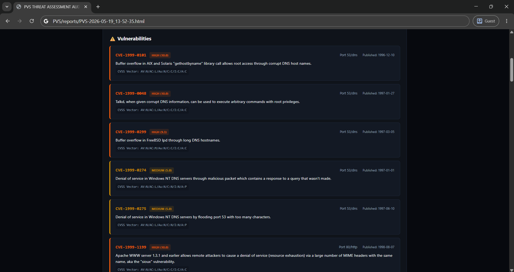

# PVS (Personal Vulnerability Scanner)

```text
  ██████╗ ██╗   ██╗███████╗
  ██╔══██╗██║   ██║██╔════╝    Personal Vulnerability Scanner
  ██████╔╝██║   ██║███████╗    v1.0.0
  ██╔═══╝ ╚██╗ ██╔╝╚════██║
  ██║      ╚████╔╝ ███████║    Ethical Security Testing
  ╚═╝       ╚═══╝  ╚══════╝
```

**PVS** is a high-performance, asynchronous command-line tool designed for network reconnaissance and vulnerability assessment. It streamlines the process of discovering open ports, identifying running services, and correlating them with known security vulnerabilities using the NIST National Vulnerability Database (NVD).

*Developed by **Mohamed Essam Elsadany**.*

PVS is designed to be accessible for beginners (requiring zero setup using the pre-compiled binary) while providing the speed, architecture depth, and parameter controls required by cybersecurity experts.

---

## 🖥️ Interface Showcase

### 1. Interactive Command Line Interface (CLI)
The PVS terminal interface handles target profiling, active host ping sweeps, async socket workers, and prints structured tables of open ports:

* **Host Discovery and Disclaimer Banner:**
  

* **Asynchronous Scan Progress Monitor:**
  

* **Recon Audit Output Details (Part 1):**
  

* **Recon Audit Output Details (Part 2):**
  

### 2. Polished HTML Scan Dashboard
PVS generates visually stunning, slate-cyan HTML dashboards summarizing overall vulnerability findings:

* **Executive Summary Dashboard:**
  

* **Host Scan Details & Services List:**
  

* **NVD CVE Vulnerability Correlation List (Part 1):**
  

* **NVD CVE Vulnerability Correlation List (Part 2):**
  

---

## 🛠️ Key Capabilities

- **Asynchronous Port Scanning:** Rapidly probes network ports using Python's `asyncio` framework for high-concurrency TCP connection management.
- **Intelligent Host Discovery:** Automatically performs ICMP ping sweeps before running subnet scans to drop unresponsive hosts, saving execution time.
- **Deep Service Detection:** Performs Banner Grabbing and socket header extraction to accurately identify underlying service names and version signatures.
- **Automated CVE Correlation:** Integrates with the NIST NVD API v2.0 to locate real-world Common Vulnerabilities and Exposures (CVEs) matching discovered services.
- **Multi-Format Reporting:** Automatically archives scan results into modern HTML web reports, machine-readable JSON files, and CSV spreadsheets.

---

## 🏗️ Technical Architecture (For Experts)

PVS relies on a modern asynchronous architecture to optimize network I/O:

```
                  ┌────────────────────────────────┐
                  │          PVS Core CLI          │
                  └───────────────┬────────────────┘
                                  │
                  ┌───────────────▼────────────────┐
                  │      Host Ping Discovery       │
                  └───────────────┬────────────────┘
                                  │ (Only Live Hosts)
                  ┌───────────────▼────────────────┐
                  │    Asynchronous Port Scanner   │
                  │   - Connection Semaphore Lock  │
                  │   - Service Banner Grabbing    │
                  └───────────────┬────────────────┘
                                  │
                  ┌───────────────▼────────────────┐
                  │     Parallel NVD API Client    │
                  │   - Local Cache Lookup         │
                  │   - NVD Rate-Limit Semaphores  │
                  └───────────────┬────────────────┘
                                  │
                  ┌───────────────▼────────────────┐
                  │     Report Generation Engine   │
                  │      (HTML, JSON, CSV)         │
                  └────────────────────────────────┘
```

- **I/O Concurrency:** Leverages `asyncio.Semaphore` to cap socket descriptors, preventing OS resource exhaustion and firewall rate-limiting blocks.
- **NVD Query Optimizations:** Implements an internal rate-limiter wrapper and local caching to respect the NIST API constraints while maintaining high query performance.

---

## 📥 Installation

Ensure you have Python 3.10+ installed on your system.

```bash
# 1. Clone the repository
git clone https://github.com/MElsadany2165/PVS.git
cd PVS

# 2. Set up virtual environment
python -m venv venv
source venv/bin/activate  # On Windows: .\venv\Scripts\activate

# 3. Install required libraries
pip install -r requirements.txt
```

### Running the Scanner

Once setup is complete, you can run the scanner easily directly using Python:

- **Running via python/py (from the workspace root)**:
  ```powershell
  py PVS scan 127.0.0.1
  ```
  *(Note: You can also use `python -m pvs scan 127.0.0.1`)*

- **Running from the parent directory**:
  If you are in the parent directory of the cloned `PVS` repository, you can simply run:
  ```powershell
  py PVS scan 127.0.0.1
  ```

- **Alternative: Install as a local command-line tool**:
  You can install the package locally in editable mode:
  ```bash
  pip install -e .
  ```
  After installation, the `pvs` command will be available directly in your terminal:
  ```bash
  pvs scan 127.0.0.1
  ```

---

## 🚀 Quick Start Guide

### 1. Basic Local/Host Discovery Scan
Scan the top 20 ports of a target to discover open ports:
```powershell
py PVS scan 127.0.0.1 -p top20
```

### 2. Deep Vulnerability Scan
Grab service banners, identify application versions, and automatically check them against the NIST CVE database:
```powershell
py PVS scan 192.168.1.1 -p top100 --cve
```

### 3. Exhaustive Subnet Network Audit
Audit a whole subnet range for all 65,535 TCP ports with high speed (500 parallel workers), perform CVE checks, and export all report formats (`reports/PVS-*`):
```powershell
py PVS scan 192.168.1.0/24 -p all --cve -c 500 -t 1.5 -f all
```

---

## 🎛️ Port Presets & Options Reference

### Port Scan Presets
Specify ports using ranges (e.g., `-p 22,80,443` or `-p 1-1024`) or the following built-in preset shortcuts:
- `top20` (Scans top 20 standard ports)
- `top100` (Scans top 100 common services)
- `common` (Scans 1,000 standard ports)
- `enterprise` (Scans 5,000 corporate network ports)
- `all` (Scans full 1 to 65,535 TCP range)

### CLI Command Options Table
| Option | Short Flag | Description | Default |
| :--- | :--- | :--- | :--- |
| `--ports` | `-p` | Set target port numbers, ranges, or presets | `top100` |
| `--cve` | | Enable CVE vulnerability correlation from NIST NVD | Disabled |
| `--format` | `-f` | Export reports formats (`html`, `json`, `csv`, `all`) | `html` |
| `--concurrency`| `-c` | Maximum concurrent async socket connections | `100` |
| `--timeout` | `-t` | Max socket response wait time in seconds | `2.0` |
| `--quiet` | `-q` | Silent console execution (runs scan without prints) | Disabled |

---

## 🔑 NVD API Key Integration (For Experts)
To perform large subnet scans without getting rate-limited by the NIST API:
1. Request a free API Key from the [NVD Developer Portal](https://nvd.nist.gov/developers/request-an-api-key).
2. Export the API Key in your terminal session before starting your scans:
   * **PowerShell:**
     ```powershell
     $env:NVD_API_KEY="your_api_key_here"
     ```
   * **Linux/macOS Bash:**
     ```bash
     export NVD_API_KEY="your_api_key_here"
     ```
PVS will automatically detect the key, increasing rate limits by **10x** for fast, high-volume CVE lookups.

---

## 📊 Report Outputs

Each scan creates detailed summaries in your project root `reports/` folder:
- **Interactive UI:** Console printouts managed by Rich, featuring clear, formatted status cards.
- **HTML Report:** Styled Web dashboard optimized with a premium cybersecurity Cyan-Slate layout, complete with threat severity metrics and CVE exploit details.
- **JSON & CSV:** Standard outputs for scripting, database logging, or automated dashboard integrations.

---

## 🛠️ Developer & Test Guide

If you want to run tests or modify code:
1. Set up dev dependencies:
   ```powershell
   pip install -r requirements.txt
   pip install -e .[dev]
   ```
2. Run pytest suite:
   ```powershell
   python -m pytest
   ```


---

## ⚖️ Authorized Use Policy

**WARNING:** This tool is strictly intended for **authorized network audits, ethical security testing, and educational purposes**.
- Do not scan networks or hosts you do not own or lack explicit authorization to audit.
- Misuse of this software may violate computer crime laws (such as the US CFAA or local equivalents). The developers assume zero liability for any damages or policy violations.

---

## 📄 License
MIT License - Copyright (c) 2026 Mohamed Essam Elsadany
