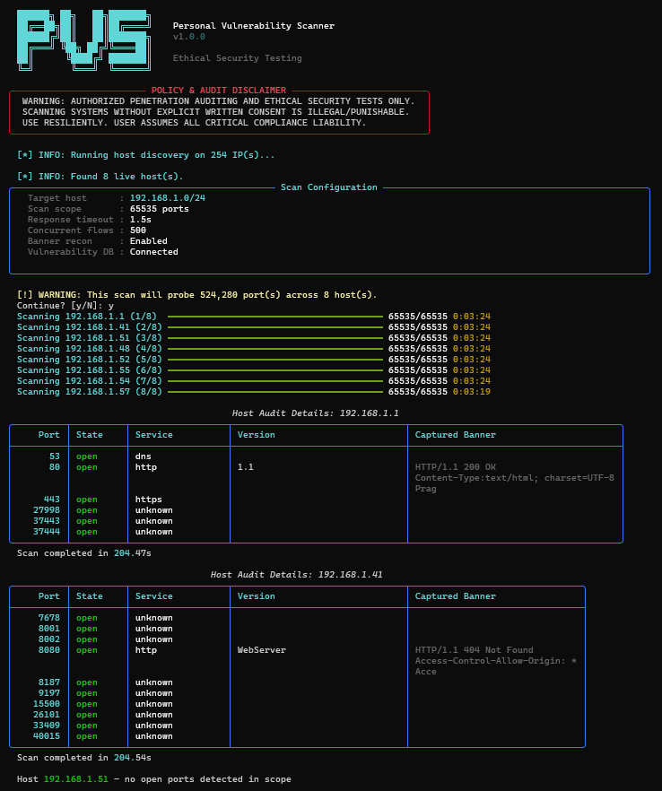

<p align="center">
  
</p>

<h1 align="center">PVS — Personal Vulnerability Scanner</h1>

<p align="center">
  <strong>High-Speed Network Audit, Service Fingerprinting, Threat Intelligence & Multi-OS Remediation Platform.</strong><br>
  <em>Engineered for effortless 1-click home security checks and enterprise-grade penetration audits.</em>
</p>

<p align="center">
  <a href="#-installation-guide-all-operating-systems"></a>
  <a href="LICENSE"></a>
  <a href="https://github.com/MElsadany2165/PVS/releases"></a>
  <a href="#-development--automated-testing"></a>
  <a href="#-installation-guide-all-operating-systems"></a>
  <a href="#%EF%B8%8F-legal-disclaimer"></a>
</p>

---

## 💡 What is PVS?

**PVS (Personal Vulnerability Scanner & Remediation Engine)** is a zero-dependency, open-source security assessment platform designed to bridge the gap between everyday computer users and enterprise penetration testers.

Most security tools give you raw numbers or cryptic warnings without telling you what to do next. PVS is different: **it doesn't just find security flaws — it delivers the exact step-by-step commands to eliminate each threat on Linux, Windows, and macOS.**

### 🎯 The Dual-Mission Architecture

1. **For Everyday Users & Non-Techies (Home Security Guard)**  
   - Zero technical knowledge required.
   - 1-Click execution via `PVS.bat` on Windows or `./pvs.sh` on Linux/macOS.
   - Interactive conversational assistant (`pvs wizard`) that speaks plain English with zero confusing jargon.
   - Automatic home network discovery (detects your Wi-Fi router, PC, and connected devices).
   - Generates an interactive visual HTML Dashboard with color-coded risk cards and one-click **"Copy Fix"** buttons.

2. **For Cybersecurity Professionals & Sysadmins (Pentest & Audit Engine)**  
   - Non-blocking asynchronous network scanner powered by Python `asyncio` handling thousands of concurrent connections.
   - Multi-source Threat Intelligence Engine combining **NIST NVD API v2.0**, **CISA Known Exploited Vulnerabilities (KEV) Catalog**, **OSV.dev**, and a **Curated Offline Zero-Latency CVE Database**.
   - Active network vulnerability probing: tests for unauthenticated databases, exposed Docker sockets, SMBv1/EternalBlue, RDP without NLA, anonymous FTP, cleartext protocols, sensitive web file leaks (`.env`, `.git`), and weak TLS ciphers.
   - Local SQLite persistent caching (`~/.pvs/vuln_cache.db`) delivering sub-millisecond `<1ms` cached queries.
   - CI/CD and SIEM ready with structured JSON, CSV, and HTML reporting pipelines.

---

## 📦 Installation Guide (All Operating Systems)

PVS requires **Python 3.10 or higher**. It relies exclusively on Python standard libraries (`asyncio`, `socket`, `ssl`, `sqlite3`, `json`) plus `rich` for terminal UI, requiring no C compilers, Npcap drivers, or heavy dependencies.

```
Operating System Compatibility:
  ✓ Windows 10, Windows 11, Windows Server (PowerShell & CMD)
  ✓ Linux (Ubuntu, Debian, Kali, Fedora, RHEL, CentOS, Arch, Alpine)
  ✓ macOS (Apple Silicon M1/M2/M3/M4 & Intel x86_64)
  ✓ Docker & Containers (Docker Hub / OCI compliant)
  ✓ WSL2 (Windows Subsystem for Linux)
```

---

### 🪟 Windows Installation (Windows 10, 11, Server)

#### Step 1: Install Python
Ensure Python 3.10+ is installed from [python.org](https://www.python.org/downloads/).  
> [!IMPORTANT]
> During setup, make sure to check the box: **"Add python.exe to PATH"**.

#### Step 2: Clone and Install
Open **PowerShell** or **Command Prompt**:
```powershell
# Clone the repository
git clone https://github.com/MElsadany2165/PVS.git
cd PVS

# Install PVS globally
pip install .
```

#### Step 3: (Optional) 1-Click Desktop Shortcut
To launch PVS anytime without opening a terminal, generate a Desktop icon:
```powershell
pvs shortcut
```
This places a **"PVS Security Assistant"** shortcut on your Desktop pointing to `PVS.bat`.

---

### 🐧 Linux Installation (Ubuntu, Debian, Kali, Fedora, Arch)

#### Step 1: Install Prerequisites
```bash
# Ubuntu / Debian / Kali Linux
sudo apt update && sudo apt install -y python3 python3-pip python3-venv git

# Fedora / RHEL / CentOS
sudo dnf install -y python3 python3-pip git

# Arch Linux / Manjaro
sudo pacman -S python python-pip git
```

#### Step 2: Clone and Install
```bash
# Clone the repository
git clone https://github.com/MElsadany2165/PVS.git
cd PVS

# Option A: Isolated virtual environment (Recommended for PEP 668 / Debian 12+ / Ubuntu 23.04+)
python3 -m venv venv
source venv/bin/activate
pip install .

# Option B: Global installation using pipx (PEP 668 friendly)
pipx install .

# Option C: Global pip install (Debian/Ubuntu override if needed)
pip install . --break-system-packages
```

#### Step 3: Run
```bash
# Direct CLI command (if installed globally or venv active)
pvs

# Or execute the included launcher script:
chmod +x pvs.sh
./pvs.sh
```

---

### 🍏 macOS Installation (Apple Silicon M1/M2/M3/M4 & Intel)

#### Step 1: Install Python & Git via Homebrew
```bash
brew install python git
```

#### Step 2: Clone and Install
```bash
git clone https://github.com/MElsadany2165/PVS.git
cd PVS

# Virtual environment setup
python3 -m venv venv
source venv/bin/activate
pip install .
```

#### Step 3: Run
```bash
chmod +x pvs.sh
./pvs.sh
```

---

### 🐳 Docker & Container Deployment

Run PVS in an isolated container without installing Python locally:

```bash
# Build the Docker image
docker build -t pvs .

# Run one-command home scan (mount reports to local folder)
docker run --rm -it --net=host -v "$(pwd)/reports:/app/reports" pvs quick

# Run targeted scan
docker run --rm -it --net=host -v "$(pwd)/reports:/app/reports" pvs scan 192.168.1.1
```

---

## 🟢 Beginner's Guide: How to Use PVS

You don't need any technical background to check your home Wi-Fi or personal computer for security risks.

### 🚀 Method 1: The 1-Click Security Assistant (Recommended)

1. **On Windows**: Double-click `PVS.bat` in the PVS folder.  
   **On Linux / macOS**: Run `./pvs.sh` in your terminal.
2. The interactive assistant appears:
   ```
   Select Audit Mode:
     [1] Home Safety Check      (Quick, simple, no technical knowledge needed)
     [2] Security Learning Lab   (Hands-on learning with educational explanations)
     [3] CyberSec Professional  (Enterprise-grade penetration testing presets)
     [4] Custom Targeted Audit   (Full manual control)
   ```
3. Type `1` and press `[Enter]`.
4. PVS will detect your Wi-Fi network and confirm:
   `"I'll scan your home network (192.168.1.0/24) for security issues. Continue? [Y/n]"`
5. Press `[Enter]`. PVS scans your network in 30–60 seconds and **automatically opens your visual HTML report in your web browser!**

---

### ⚡ Method 2: The One-Command Quick Scan

Open your terminal and run:
```bash
# Scan entire home Wi-Fi network
pvs quick

# Scan only this computer
pvs quick me
```

PVS will:
1. Scan for open ports and listening services.
2. Audit for security vulnerabilities, weak settings, and known bugs.
3. Automatically launch your browser displaying the full interactive HTML dashboard.

---

### 📊 Understanding Your HTML Security Dashboard

When your scan finishes, PVS saves an HTML report in the `reports/` folder:

- **Security Overview Card**: Shows how many devices are on your network and how many doors (ports) are open.
- **Threat Cards**: Displays any detected vulnerabilities ranked by severity:
  - 🔴 **CRITICAL**: Immediate danger! Attackers can take over the device or execute remote code.
  - 🟠 **HIGH**: Serious security gap (e.g. unencrypted passwords or vulnerable service version).
  - 🟡 **MEDIUM**: Weak configuration that should be hardened.
  - 🟢 **LOW / SAFE**: Informational finding or safe service.
- **🚨 CISA KEV Badges**: Marks bugs that hackers are actively exploiting in the wild right now.
- **🛠️ Multi-OS Step-by-Step Remediation Accordions**: Click on any finding to reveal step-by-step fix instructions. Click the **Linux**, **Windows**, or **macOS** tab, and click the **Copy** button to copy the exact terminal command to fix the issue!

---

## 🛡️ Professional & Pentester Guide: Advanced CLI Control

PVS is a complete command-line penetration testing and vulnerability auditing tool.

### 🎯 1. Target Formats
```bash
# Single IP target
pvs scan 192.168.1.10

# Hostname / Domain
pvs scan testfire.net

# Entire CIDR Subnet (Class C /24 or custom mask)
pvs scan 192.168.1.0/24

# IP Range
pvs scan 192.168.1.1-50

# Smart target aliases
pvs scan home        # Auto-detects local subnet CIDR
pvs scan me          # Targets localhost 127.0.0.1
```

---

### 🔌 2. Port Selection & Presets
Control the port scope with `-p` / `--ports`:
```bash
# Specific ports
pvs scan 192.168.1.1 -p 22,80,443,3389,8080

# Port range
pvs scan 192.168.1.1 -p 1-1024

# Built-in presets
pvs scan 192.168.1.1 -p top20       # Top 20 most scanned ports
pvs scan 192.168.1.1 -p top100      # Top 100 ports (default)
pvs scan 192.168.1.1 -p common      # 1,000 standard service ports
pvs scan 192.168.1.1 -p enterprise  # 5,000 enterprise ports
pvs scan 192.168.1.1 -p all         # Full spectrum (1-65,535)
```

---

### 🔒 3. Threat Scanning & Remediation
By default in PVS v2.0, **vulnerability scanning (`--cve`) and remediation procedures (`--fix`) are enabled automatically.**

```bash
# Standard scan: audits host, finds CVEs, prints terminal fix guides, and generates HTML report
pvs scan 192.168.1.1

# Automatically open HTML report in web browser upon completion
pvs scan 192.168.1.1 --open

# Retrieve up to 10 CVEs per service
pvs scan 192.168.1.1 --max-cves 10

# Fast port scan only (disable CVE lookup and active probes)
pvs scan 192.168.1.1 --no-cve

# Hide terminal fix guides (still saved in report)
pvs scan 192.168.1.1 --no-fix

# Skip host discovery ICMP ping (scan firewalled hosts)
pvs scan 192.168.1.0/24 --no-ping
```

---

### ⚡ 4. High-Performance Concurrency Tuning
```bash
# 500 concurrent connections with 1.0s timeout for high-speed subnet audit
pvs scan 192.168.1.0/24 -p common -c 500 -t 1.0
```

---

### 🔑 5. NIST NVD API Key (Higher Rate Limits)
By default, PVS uses an offline curated database and public NVD endpoints. To increase NIST rate limits for enterprise audits:
1. Get a free API key at [nvd.nist.gov/developers/request-an-api-key](https://nvd.nist.gov/developers/request-an-api-key).
2. Set environment variable:
   - **Linux / macOS**: `export NVD_API_KEY="your_api_key"`
   - **Windows PowerShell**: `$env:NVD_API_KEY="your_api_key"`
3. Or pass it directly: `pvs scan 192.168.1.1 --nvd-api-key your_api_key`

---

### 📄 6. Multi-Format Report Exporting
```bash
# HTML report (default)
pvs scan 192.168.1.1 -f html

# JSON report (for SIEM or CI/CD pipelines)
pvs scan 192.168.1.1 -f json

# CSV spreadsheet report
pvs scan 192.168.1.1 -f csv

# Export ALL formats simultaneously
pvs scan 192.168.1.0/24 -p common -f all

# Specify custom output path
pvs scan 192.168.1.1 -o reports/audit_2026.html
```

---

## 🔍 Deep Dive: What PVS Scans & How to Fix Each Threat

PVS executes deep active probes and semantic version matching to detect real-world network vulnerabilities. The table below details every category, the security risk, and the remediation procedures PVS provides to eliminate the threat:

| Vulnerability / Threat | Port / Service | Threat & Risk | How to Solve & Eliminate (Remediation) |
|:---|:---|:---|:---|
| **Redis Unauthenticated Remote Access** | 6379 (Redis) | **CRITICAL (10.0)**: Attackers can execute arbitrary code, dump memory, or overwrite root SSH keys. | **Linux**: In `/etc/redis/redis.conf`, set `bind 127.0.0.1` and `requirepass <STRONG_PASS>`, then restart Redis.<br>**Windows**: Restrict port 6379 in Windows Defender Firewall; enforce password auth. |
| **MongoDB Public Unauthenticated Access** | 27017 (MongoDB) | **CRITICAL (9.8)**: Full unauthorized access to databases; data exfiltration and ransomware wiping. | **Linux/Windows**: In `mongod.conf`, set `security.authorization: enabled` and `net.bindIp: 127.0.0.1`. Create administrative user with SCRAM authentication. |
| **Memcached Amplification & Token Leak** | 11211 (Memcached) | **HIGH (7.5)**: Unauthenticated memory inspection and DDoS UDP reflection amplification attacks. | **Linux**: In `/etc/memcached.conf`, set `-l 127.0.0.1` and `-U 0` (disable UDP listener).<br>**Firewall**: Block port 11211 from public internet interfaces. |
| **Elasticsearch Unauthenticated Cluster** | 9200 (Elastic) | **CRITICAL (9.8)**: Complete cluster read/write access. Attackers can delete indices or steal records. | **All OS**: In `elasticsearch.yml`, configure `xpack.security.enabled: true` and execute `elasticsearch-setup-passwords auto`. |
| **Docker Daemon API Remote Exposure** | 2375 (Docker) | **CRITICAL (10.0)**: Attackers can spawn privileged root containers and take full control of host OS. | **Linux/Windows**: Never expose port 2375 to untrusted networks. Bind to Unix socket `/var/run/docker.sock` only, or enforce mutual TLS on port 2376. |
| **SMBv1 Deprecated Protocol (EternalBlue)** | 445 (SMB) | **CRITICAL (9.8)**: Vulnerable to EternalBlue (MS17-010) worm exploitation and WannaCry ransomware. | **Windows**: Run `Disable-WindowsOptionalFeature -Online -FeatureName SMB1Protocol -NoRestart`.<br>**Linux (Samba)**: Set `server min protocol = SMB2_02` in `/etc/samba/smb.conf`. |
| **RDP Network Level Auth (NLA) Disabled** | 3389 (RDP) | **HIGH (8.1)**: Pre-authentication exposure to BlueKeep (CVE-2019-0708) remote code execution. | **Windows**: Open PowerShell: `Set-ItemProperty -Path 'HKLM:\System\CurrentControlSet\Control\Terminal Server\WinStations\RDP-Tcp' -Name "UserAuthentication" -Value 1`. |
| **FTP Anonymous Login Allowed** | 21 (FTP) | **MEDIUM (5.3)**: Unauthenticated users can view or upload unauthorized files. | **Linux (vsftpd)**: Set `anonymous_enable=NO` in `/etc/vsftpd.conf`.<br>**Windows (IIS)**: Disable Anonymous Authentication in IIS FTP Site properties. |
| **Cleartext Protocol (Telnet)** | 23 (Telnet) | **HIGH (7.5)**: Plaintext transmission of root passwords and session commands across the network. | **All OS**: Disable Telnet daemon (`systemctl disable telnet.socket`), block port 23 in firewall, and migrate all administration to SSH (port 22). |
| **Cleartext Protocol (Plain FTP)** | 21 (FTP) | **HIGH (7.5)**: Plaintext credential transmission. Network sniffers can intercept passwords. | **All OS**: Migrate file transfers to secure SFTP (port 22) or mandate FTPS (FTP over TLS) with `ssl_enable=YES`. |
| **Cleartext Web Traffic (HTTP)** | 80 (HTTP) | **MEDIUM (5.3)**: Plaintext cookies and passwords vulnerable to man-in-the-middle eavesdropping. | **All OS**: Deploy free TLS certificate via Certbot / Let's Encrypt, enforce HTTPS, and configure 301 automatic redirection. |
| **Cleartext Mail (POP3 / IMAP)** | 110, 143 | **HIGH (7.5)**: Mail account passwords transmitted unencrypted across network. | **All OS**: Enforce POP3S (port 995) and IMAPS (port 993) with `ssl = required`. Block unencrypted ports 110 and 143. |
| **HTTP TRACE Method Enabled (XST)** | 80, 443 (Web) | **MEDIUM (5.3)**: Cross-Site Tracing flaw allows malicious scripts to steal HTTP-only cookies. | **Linux/Windows**: In Apache set `TraceEnable Off`; in Nginx return 405 for TRACE; in IIS disable TRACE verb. |
| **Missing HTTP Strict Transport Security (HSTS)** | 443 (HTTPS) | **LOW (3.7)**: Allows SSL-stripping downgrade attacks by man-in-the-middle adversaries. | **Web Servers**: Add header: `Strict-Transport-Security: max-age=31536000; includeSubDomains; preload`. |
| **Missing Clickjacking Defense** | 80, 443 (Web) | **LOW (3.5)**: Malicious websites can iframe application and deceive users into clicking invisible buttons. | **Web Servers**: Add security header `X-Frame-Options: DENY` and CSP `frame-ancestors 'none'`. |
| **Sensitive File Disclosure (`.env`, `.git`)** | 80, 443 (Web) | **CRITICAL/HIGH (9.1)**: Publicly exposed database passwords, API keys, or full git source code repositories. | **Web Servers**: Block dotfiles in server configuration: `RedirectMatch 404 /\.git` and `RedirectMatch 404 /\.env`. Remove exposed secret files from web root. |
| **Deprecated Insecure TLS (TLS 1.0, 1.1, SSLv3)** | 443, TLS | **HIGH (7.4)**: Deprecated protocols vulnerable to cryptographic downgrade and POODLE/BEAST attacks. | **All OS**: Configure web and mail servers to disable SSLv3, TLS 1.0, and TLS 1.1: `SSLProtocol -all +TLSv1.2 +TLSv1.3`. |
| **Legacy Weak Ciphers (3DES, RC4)** | 443, TLS | **MEDIUM (5.9)**: Vulnerable to Sweet32 (3DES) and Bar Mitzvah (RC4) plaintext recovery attacks. | **All OS**: Disable 3DES, RC4, CBC-mode ciphers; require modern AEAD ciphers (AES-GCM, ChaCha20-Poly1305). |
| **OpenSSH RegreSSHion (CVE-2024-6387)** | 22 (SSH) | **CRITICAL (8.1)**: Signal handler race condition in sshd allowing unauthenticated root RCE in Linux. | **Linux**: Run `sudo apt update && sudo apt install --only-upgrade openssh-server -y` to upgrade to OpenSSH 9.8p1 or newer. Set `LoginGraceTime 0` as interim mitigation. |
| **Terrapin Attack (CVE-2023-48795)** | 22 (SSH) | **MEDIUM (5.9)**: Sequence number manipulation allows MITM downgrade of SSH extension negotiation. | **Linux/macOS**: Upgrade OpenSSH to 9.6p1+; disable vulnerable ciphers `chacha20-poly1305` and CBC MACs. |
| **Apache Path Traversal & RCE (CVE-2021-41773)** | 80, 443 (Apache) | **CRITICAL (9.8)**: Flaw in Apache 2.4.49 path normalization allows remote file read and CGI script RCE. | **Linux/Windows**: Upgrade Apache HTTP Server to 2.4.52 or newer immediately (`apt install --only-upgrade apache2`). |
| **HTTP/2 Rapid Reset DoS (CVE-2023-44487)** | 80, 443 (Web) | **HIGH (7.5)**: Rapid stream reset flood exhausts server CPU/memory, causing denial of service. | **Web Servers**: Upgrade Nginx to 1.25.3+ or Apache to 2.4.58+; configure stream rate limiting. |

---

## 📋 Complete Command Reference Table

### Subcommands Overview

| Command | Usage | Description |
|:---|:---|:---|
| `pvs` | `pvs` or `pvs wizard` | Launches interactive 4-persona guided assistant |
| `pvs quick` | `pvs quick [target]` | Zero-config 1-command home network scan with auto-open HTML report |
| `pvs scan` | `pvs scan <target> [options]` | Direct CLI port scanner, service fingerprinter, and threat auditor |
| `pvs fix` | `pvs fix [target] [--script <path>]` | Interactive threat resolver, root-cause solver & automated script generator (.sh / .ps1) |
| `pvs verify` | `pvs verify <target> <port>` | Live re-test a port to verify if a remediation successfully eliminated the threat |
| `pvs info` | `pvs info <port\|service>` | Looks up well-known port numbers and service names |
| `pvs shortcut` | `pvs shortcut` | Creates a Desktop launcher shortcut for Windows |

---

### `pvs scan` Flags Reference

| Option | Short | Description | Default |
|:---|:---|:---|:---|
| `target` | | IP, hostname, CIDR range, or IP range (e.g. `192.168.1.0/24`, `home`, `me`) | *(Required)* |
| `--ports` | `-p` | Ports to scan: numbers (`80,443`), range (`1-1024`), or preset (`top20`/`top100`/`common`/`enterprise`/`all`) | `top100` |
| `--cve` | | Enable multi-source threat lookup (NVD + CISA KEV + OSV) | `enabled` |
| `--no-cve` | | Disable CVE and threat lookups (port scan only) | `off` |
| `--fix` | `--remediation` | Display single service remediation procedure summary in CLI output | `enabled` |
| `--no-fix` | | Hide step-by-step fix procedures in CLI output | `off` |
| `--export-script` | | Auto-generate and save ready-to-run remediation script (`.sh` or `.ps1`) | `off` |
| `--open` | | Auto-open generated HTML report in browser upon completion | `off` |
| `--timeout` | `-t` | Connection response timeout in seconds (calibrated dynamically by RTT) | `2.0` |
| `--concurrency` | `-c` | Max simultaneous concurrent sockets | `100` |
| `--format` | `-f` | Report format (`html`, `json`, `csv`, `all`) | `html` |
| `--output` | `-o` | Custom report file output path | auto-generated |
| `--nvd-api-key` | | NIST NVD API key for higher rate limits | `$NVD_API_KEY` |
| `--max-cves` | | Max CVEs to retrieve per service signature | `5` |
| `--no-cache` | | Bypass local SQLite vulnerability cache | `off` |
| `--clear-cache` | | Clear local SQLite vulnerability cache before scanning | `off` |
| `--no-audit` | | Disable active network vulnerability probes | `off` |
| `--no-ping` | | Skip ICMP ping host discovery sweep | `off` |
| `--no-banner-grab` | | Skip service version & banner detection | `off` |
| `--yes` | `-y` | Skip confirmation prompt on large (>10,000 probe) scans | `off` |
| `-q, --quiet` | `-q` | Suppress CLI banner and header output | `off` |


---

## 🏗️ Architecture & Technical Design

```
┌────────────────────────────────────────────────────────┐
│                      PVS Engine                        │
└───────────────────────────┬────────────────────────────┘
                            │
┌───────────────────────────▼────────────────────────────┐
│                Async Host Discovery                    │
│   (ICMP ping sweep for active subnet target filtering) │
└───────────────────────────┬────────────────────────────┘
                            │ Live Hosts
┌───────────────────────────▼────────────────────────────┐
│               Async TCP Port Scanner                   │
│   · Semaphore-limited non-blocking sockets             │
│   · Service banner grabbing & version fingerprinting   │
└───────────────────────────┬────────────────────────────┘
                            │ Open Ports & Service Banners
┌───────────────────────────▼────────────────────────────┐
│        Active Network Vulnerability Auditor            │
│   · Unauth DBs (Redis, Mongo, Memcached, Elastic, Docker)│
│   · SMBv1 EternalBlue & RDP NLA BlueKeep Handshakes    │
│   · Anonymous FTP & Cleartext Protocol Auditing        │
│   · Web Leaks (.env, .git) & Weak SSL/TLS Ciphers      │
└───────────────────────────┬────────────────────────────┘
                            │ Active Findings
┌───────────────────────────▼────────────────────────────┐
│         Multi-Source Threat Intelligence Engine        │
│   · Local SQLite Persistent Caching (<1ms response)    │
│   · CISA Known Exploited Vulnerabilities (KEV) Sync    │
│   · NIST NVD API v2.0 Query Engine                     │
│   · OSV.dev Open Source Vulnerability Fallback         │
└───────────────────────────┬────────────────────────────┘
                            │ Enriched CVEs & KEV Badges
┌───────────────────────────▼────────────────────────────┐
│         Multi-OS Step-by-Step Remediation              │
│   (Linux ufw/apt, Windows PowerShell, macOS pfctl/brew)│
└───────────────────────────┬────────────────────────────┘
                            │
┌───────────────────────────▼────────────────────────────┐
│               Multi-Format Exporters                   │
│   · Interactive Visual HTML Dashboard                  │
│   · Structured JSON Data Pipeline Export               │
│   · CSV Spreadsheet Audit Export                       │
└────────────────────────────────────────────────────────┘
```

---

## 🛠️ Development & Automated Testing

PVS features a robust test suite covering scanners, auditors, CVE databases, remediation generators, and the interactive wizard:

```bash
# Install development dependencies
pip install -e ".[dev]"

# Run full test suite (82 test cases)
pytest -v

# Run test coverage audit
pytest --cov=pvs
```

### Project Directory Structure
```
PVS/
├── pvs/
│   ├── cli.py          # Command line argument parser & main entry router
│   ├── wizard.py       # Interactive persona-based guided assistant
│   ├── scanner.py      # Async TCP port scanner, banner grabber & network solver
│   ├── auditor.py      # Active network vulnerability auditor
│   ├── cve_db.py       # Curated offline high-impact CVE database
│   ├── vuln_engine.py  # Multi-source threat engine (NVD, CISA KEV, OSV, SQLite cache)
│   ├── remediation.py  # Multi-OS step-by-step remediation procedure engine
│   ├── reporter.py     # HTML, JSON, and CSV report generator
│   ├── display.py      # Terminal UI renderer using Rich
│   ├── services.py     # Well-known TCP service mappings
│   └── logger.py       # Central logging module
├── tests/              # Full 82-test Pytest test suite
├── docs/               # Screenshots and media assets
├── Dockerfile          # Production container image definition
├── .dockerignore       # Container build exclusions
├── PVS.bat             # Windows 1-click launcher
├── pvs.sh              # Linux & macOS launcher script
├── setup.py            # Legacy setup entrypoint
├── pyproject.toml      # Package build and dependency metadata
└── README.md           # Documentation
```

---

## ❓ Frequently Asked Questions (FAQ)

#### Q: "No live hosts discovered (all pings failed)" — what should I do?
Some home routers and personal firewalls block ICMP ping probes. Use `--no-ping` to scan ports directly:
```bash
pvs scan 192.168.1.0/24 --no-ping
```

#### Q: Does PVS send any sensitive data or scan results to external servers?
**No.** All scan traffic is executed locally from your computer. Only public vulnerability definitions (CVE entries) are fetched from NIST NVD, CISA, and OSV.dev. No target IPs, device names, or scan results ever leave your machine.

#### Q: Can I run PVS completely offline without an internet connection?
**Yes!** PVS includes a built-in curated offline vulnerability database and local active auditing probes. If your machine is offline, PVS automatically switches to offline mode without crashing or hanging.

#### Q: How do I export results directly into Excel or a spreadsheet?
Run with `-f csv`:
```bash
pvs scan 192.168.1.1 -f csv
```
Open the generated `.csv` file in Microsoft Excel, Google Sheets, or LibreOffice Calc.

---

## ⚖️ Legal Disclaimer

> [!CAUTION]
> **Authorized Ethical Use Only.** PVS is developed strictly for authorized security auditing, network maintenance, ethical penetration testing, and educational research.
>
> - **Do not** scan targets, subnets, or infrastructure without explicit prior written permission.
> - Unauthorized port scanning and security probing may violate local, national, and international cybercrime laws, including the **US Computer Fraud and Abuse Act (CFAA)**, **UK Computer Misuse Act**, **EU NIS2 Directive**, or equivalent legislation.
> - The developers assume **zero liability** for unauthorized use, damages, or legal consequences resulting from this tool.

---

## 📄 License

[MIT License](LICENSE) — Copyright © 2026 [Mohamed Essam Elsadany](https://github.com/MElsadany2165).
