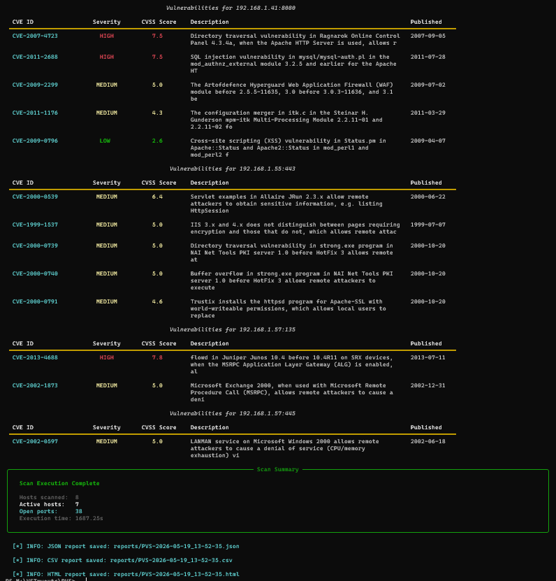
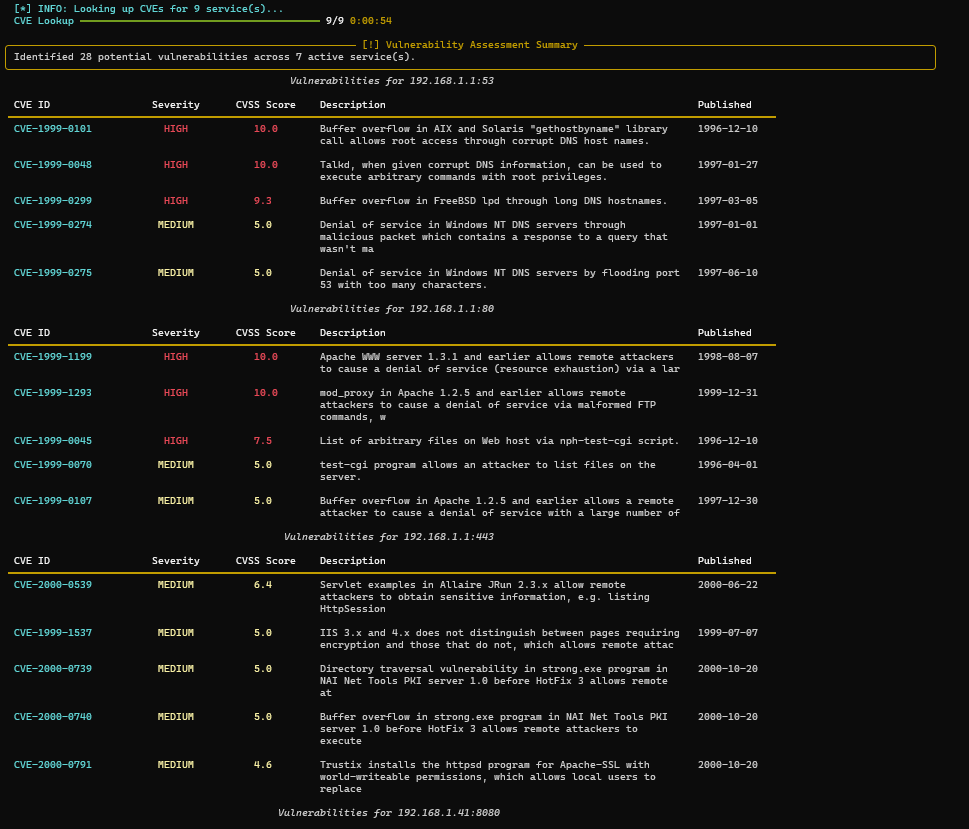
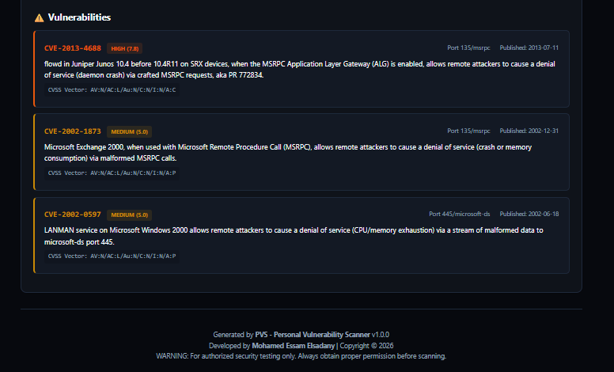
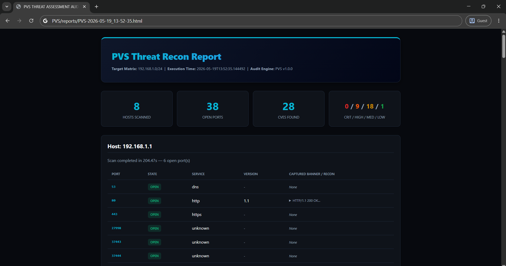
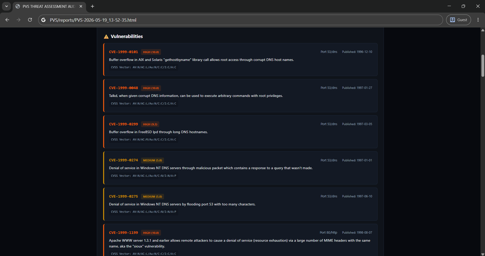

<p align="center">
  
</p>

<h1 align="center">PVS — Personal Vulnerability Scanner</h1>

<p align="center">
  <strong>High-Speed Network Audit, Service Fingerprinting, Threat Intelligence & Multi-OS Remediation Engine.</strong><br>
  <em>Engineered for effortless 1-click home security checks and enterprise-grade penetration audits.</em>
</p>

<p align="center">
  <a href="#-installation--setup"></a>
  <a href="LICENSE"></a>
  <a href="https://github.com/MElsadany2165/PVS/releases"></a>
  <a href="#%EF%B8%8F-legal-disclaimer"></a>
</p>

---

## 💡 What is PVS?

**PVS (Personal Vulnerability Scanner)** is an open-source security recon, vulnerability assessment, and remediation platform built with a **dual-mission design**:

1. **Simple & Friendly for Everyday Users**  
   Zero technical knowledge needed. Double-click `PVS.bat` or run `pvs quick` to auto-detect your home Wi-Fi network, discover live devices, run a full security check, and view an interactive visual report in your browser with plain-English risk explanations and step-by-step fix guides.

2. **Advanced & Powerful for Cybersecurity Professionals**  
   High-throughput asynchronous TCP scanner powered by Python `asyncio`. Integrates a **Multi-Source Threat Intelligence Engine** ([NIST NVD API v2.0](https://nvd.nist.gov/), [CISA KEV Catalog](https://www.cisa.gov/known-exploited-vulnerabilities-catalog), and [OSV.dev](https://osv.dev/)), persistent local SQLite caching (`~/.pvs/vuln_cache.db`), CIDR range scanning, enterprise port presets, and copy-paste remediation procedures for **Linux**, **Windows**, and **macOS**.

---

## 📥 Installation & Setup

### Prerequisites
- **Python 3.10 or higher**: Download from [python.org](https://www.python.org/downloads/) (ensure *"Add Python to PATH"* is checked during setup).
- **Git**: Download from [git-scm.com](https://git-scm.com/).

---

### Step 1: Clone the Repository
Open your terminal (PowerShell, Command Prompt, or Bash) and clone PVS:
```bash
git clone https://github.com/MElsadany2165/PVS.git
cd PVS
```

---

### Step 2: Install PVS

#### Method A: Global System-Wide Installation (Recommended)
Installs the `pvs` binary directly into your system PATH:
```bash
pip install .
```
Now you can type `pvs` from any directory in your terminal!

#### Method B: Virtual Environment Setup (Isolated)
```bash
# Create virtual environment
python -m venv venv

# Activate on Windows (PowerShell):
.\venv\Scripts\Activate.ps1

# Activate on Linux / macOS:
source venv/bin/activate

# Install in editable mode:
pip install -e .
```

---

### 🖥️ Windows Desktop Shortcut (1-Click App Launcher)
For non-technical users who prefer clicking a desktop icon like a normal application:
```bash
pvs shortcut
```
This automatically creates a **"PVS Security Assistant"** shortcut right on your Windows Desktop pointing to `PVS.bat`. Double-clicking it launches the interactive scanner immediately!

---

## 🟢 Beginner's Guide (Zero Technical Knowledge Needed)

PVS makes checking your network security as simple as clicking a button. You don't need to know IP addresses, CIDR blocks, or port numbers.

### Option 1: Interactive Security Assistant (Wizard)
Simply run `pvs` in your terminal or double-click `PVS.bat`:
```bash
pvs
```
You will be greeted by a simple guided menu:
```
Select Audit Mode:
  [1] Home Safety Check      (Quick, simple, no technical knowledge needed)
  [2] Security Learning Lab   (Hands-on learning with explanations & full exports)
  [3] CyberSec Professional  (Enterprise-grade penetration testing presets)
  [4] Custom Targeted Audit   (Full manual control over every parameter)
```
1. Type `1` and press `[Enter]`.
2. Select **My Home Network** (PVS automatically detects your Wi-Fi router & IP address).
3. Press `[Enter]` to start the scan.
4. When finished, PVS opens your **Visual HTML Report** in your web browser automatically!

---

### Option 2: 1-Command Quick Home Scan
Scan your entire home network in a single command:
```bash
pvs quick
```
- Auto-detects your local network range (e.g. `192.168.1.0/24` or `172.20.10.0/24`).
- Scans common open ports on all connected devices.
- Checks for known vulnerabilities and active security bugs.
- Auto-launches the HTML Security Dashboard in your browser.

---

### Option 3: Scan Only This Computer
Want to check what services are running on your own PC?
```bash
pvs quick me
```

---

### 📊 Reading Your Interactive Visual HTML Report
When a scan completes, PVS generates an interactive `.html` report saved in the `reports/` folder and opens it in your default browser.

- **Security Overview**: Displays total active devices, open ports, and identified threat levels.
- **Color-Coded Severity**:
  - 🔴 **CRITICAL / HIGH**: High-risk security bugs that need immediate fixing.
  - 🟡 **MEDIUM**: Moderate vulnerabilities that should be patched soon.
  - 🟢 **LOW / SAFE**: Normal low-risk service info or safe ports.
- **🚨 CISA KEV Badges**: Highlights vulnerabilities that are actively exploited by hackers in the wild right now according to the US CISA catalog.
- **🛠️ Multi-OS Step-by-Step Remediation Accordions**: Click on any detected vulnerability to expand a step-by-step fix guide with copy-paste commands for **Linux 🐧**, **Windows 🪟**, and **macOS 🍏**. Click the **Copy** button to copy fix commands directly to your clipboard!

---

## 🛡️ Expert & Pentester Guide (Advanced CLI Control)

PVS gives security researchers, sysadmins, and penetration testers full command-line control over targeting, port ranges, asynchronous concurrency, threat feeds, and export formats.

### 🎯 1. Target Specifications
PVS accepts flexible target formats:

```bash
# Single IP Address
pvs scan 192.168.1.50

# Domain Name / Hostname
pvs scan scanme.nmap.org

# Entire CIDR Subnet
pvs scan 192.168.1.0/24

# IP Range Specification
pvs scan 192.168.1.10-50

# Smart Target Keywords
pvs scan home        # Auto-detects local network CIDR
pvs scan me          # Targets 127.0.0.1 (localhost)
```

---

### 🔌 2. Port Scope Specifications & Presets
Control which TCP ports to scan using `-p` / `--ports`:

```bash
# Specific Ports
pvs scan 192.168.1.1 -p 22,80,443,8080

# Port Range
pvs scan 192.168.1.1 -p 1-1024

# Built-In Presets
pvs scan 192.168.1.1 -p top20       # Top 20 most scanned ports
pvs scan 192.168.1.1 -p top100      # Top 100 common ports (default)
pvs scan 192.168.1.1 -p common      # 1,000 standard service ports
pvs scan 192.168.1.1 -p enterprise  # 5,000 enterprise service ports
pvs scan 192.168.1.1 -p all         # Full TCP spectrum (1-65,535)
```

---

### 🔒 3. Vulnerability Lookup & Threat Intelligence
Enable multi-source vulnerability lookups using `--cve` and display CLI fix procedures with `--fix`:

```bash
# Host audit with CVE threat lookup & terminal fix summaries
pvs scan 192.168.1.1 --cve --fix

# Retrieve up to 10 CVEs per service signature
pvs scan 192.168.1.1 --cve --max-cves 10
```

#### Multi-Source Threat Architecture
- **NIST NVD API v2.0**: Queries official Common Product Enumeration (CPE) signatures and CVE metrics.
- **CISA KEV Catalog**: Background syncs CISA Known Exploited Vulnerabilities to flag active wild exploits.
- **OSV.dev Fallback**: Automatically queries OSV open-source vulnerability database if NVD API is throttled or unreachable.
- **Persistent SQLite Cache (`~/.pvs/vuln_cache.db`)**: Stores query results locally for `<1ms` instant cached lookups.

#### Cache Management
```bash
# Bypass local SQLite cache (force fresh remote API queries)
pvs scan 192.168.1.1 --cve --no-cache

# Clear local SQLite cache database before scanning
pvs scan 192.168.1.1 --cve --clear-cache
```

---

### 🔑 4. Configuring Free NVD API Key (Higher Rate Limits)
By default, unauthenticated NVD API calls are rate-limited by NIST to 5 requests per 30 seconds. To remove rate limits for large subnets:

1. Request a **free** API key from the [NIST NVD Developer Portal](https://nvd.nist.gov/developers/request-an-api-key).
2. Export your API key in your terminal environment:

**Windows (PowerShell):**
```powershell
$env:NVD_API_KEY="your_api_key_here"
```

**Linux / macOS (Bash):**
```bash
export NVD_API_KEY="your_api_key_here"
```

Or pass it directly in the scan command:
```bash
pvs scan 192.168.1.0/24 --cve --nvd-api-key your_api_key_here
```

---

### ⚡ 5. High-Throughput Performance Tuning
Tune connection concurrency and timeout for fast internal audits:

```bash
# High-speed subnet scan (500 concurrent workers, 1.0s timeout)
pvs scan 192.168.1.0/24 -p common -c 500 -t 1.0

# Skip host discovery ping sweep (force port scan all IPs in subnet)
pvs scan 192.168.1.0/24 --no-ping

# Disable service banner grabbing for raw port checks
pvs scan 192.168.1.0/24 --no-banner-grab
```

---

### 📄 6. Audit Report Exporting & Formats
PVS can export structured audit reports in HTML, JSON, and CSV format:

```bash
# Export single HTML report (default)
pvs scan 192.168.1.1 -f html

# Export JSON structured report for SIEM / pipeline integration
pvs scan 192.168.1.1 -f json

# Export CSV spreadsheet report
pvs scan 192.168.1.1 -f csv

# Export ALL formats (HTML + JSON + CSV) simultaneously
pvs scan 192.168.1.0/24 -p enterprise --cve --fix -f all

# Specify custom output path
pvs scan 192.168.1.1 -o reports/audit_result.html
```

---

### 🔍 7. Port & Service Recon Lookup (`pvs info`)
Quickly look up well-known ports or service signatures without running a network scan:

```bash
# Look up service running on port 443
pvs info 443

# Look up ports associated with SSH
pvs info ssh
```

---

## 📋 Full Command & Option Reference Table

### Subcommands Overview

| Command | Usage | Description |
|:---|:---|:---|
| `pvs` | `pvs` or `pvs wizard` | Launches interactive 4-persona guided wizard |
| `pvs quick` | `pvs quick [target]` | Zero-config 1-command home network scan with auto-open HTML report |
| `pvs scan` | `pvs scan <target> [options]` | Direct CLI port scanner, service fingerprinter, and threat auditor |
| `pvs info` | `pvs info <port|service>` | Looks up well-known port numbers and service names |
| `pvs shortcut` | `pvs shortcut` | Creates a Desktop launcher shortcut for Windows |

---

### `pvs scan` Flags Reference

| Option | Short | Description | Default |
|:---|:---|:---|:---|
| `target` | | IP, hostname, CIDR range, or IP range | *(Required)* |
| `--ports` | `-p` | Ports to scan: numbers (`80,443`), range (`1-1024`), or preset (`top20`/`top100`/`common`/`enterprise`/`all`) | `top100` |
| `--cve` | | Enable multi-source threat lookup (NVD + CISA KEV + OSV) | `off` |
| `--fix` | `--remediation` | Display single service remediation procedure summary in CLI output | `off` |
| `--open` | | Auto-open generated HTML report in browser upon completion | `off` |
| `--timeout` | `-t` | Connection response timeout in seconds | `2.0` |
| `--concurrency` | `-c` | Max simultaneous concurrent sockets | `100` |
| `--format` | `-f` | Report format (`html`, `json`, `csv`, `all`) | `html` |
| `--output` | `-o` | Custom report file output path | auto-generated |
| `--nvd-api-key` | | NIST NVD API key for higher rate limits | `$NVD_API_KEY` |
| `--max-cves` | | Max CVEs to retrieve per service signature | `5` |
| `--no-cache` | | Bypass local SQLite vulnerability cache | `off` |
| `--clear-cache` | | Clear local SQLite vulnerability cache before scanning | `off` |
| `--no-ping` | | Skip ICMP ping host discovery sweep | `off` |
| `--no-banner-grab` | | Skip service version & banner detection | `off` |
| `--yes` | `-y` | Skip confirmation prompt on large (>10,000 probe) scans | `off` |
| `-q, --quiet` | `-q` | Suppress CLI banner and header output | `off` |

---

## 🏗️ Architecture & Technical Design

PVS is designed around a non-blocking asynchronous pipeline for maximum network throughput and minimal memory overhead:

```
┌────────────────────────────────────────────────────────┐
│                      PVS Engine                        │
└───────────────────────────┬────────────────────────────┘
                            │
┌───────────────────────────▼────────────────────────────┐
│                Async Host Discovery                    │
│   (ICMP ping sweep for active subnet target filtering) │
└───────────────────────────┬────────────────────────────┘
                            │ Live Hosts
┌───────────────────────────▼────────────────────────────┐
│               Async TCP Port Scanner                   │
│   · Semaphore-limited non-blocking sockets             │
│   · Service banner grabbing & version fingerprinting   │
└───────────────────────────┬────────────────────────────┘
                            │ Open Ports & Service Banners
┌───────────────────────────▼────────────────────────────┐
│         Multi-Source Threat Intelligence Engine        │
│   · Local SQLite Persistent Caching (<1ms response)    │
│   · CISA Known Exploited Vulnerabilities (KEV) Sync    │
│   · NIST NVD API v2.0 Query Engine                     │
│   · OSV.dev Open Source Vulnerability Fallback         │
└───────────────────────────┬────────────────────────────┘
                            │ Enriched CVEs & KEV Badges
┌───────────────────────────▼────────────────────────────┐
│         Multi-OS Step-by-Step Remediation              │
│   (Linux ufw/apt, Windows PowerShell, macOS pfctl/brew)│
└───────────────────────────┬────────────────────────────┘
                            │
┌───────────────────────────▼────────────────────────────┐
│               Multi-Format Exporters                   │
│   · Interactive Visual HTML Dashboard                  │
│   · Structured JSON Data Pipeline Export               │
│   · CSV Spreadsheet Audit Export                       │
└────────────────────────────────────────────────────────┘
```

---

## 🖥️ Visual Tour & Screenshots

### CLI — Live Host Discovery & Scan Progress
Clean, non-cluttered progress bar with real-time target status:

<p align="center">
  
</p>

### CLI — Port & Service Audit Results
Structured per-host audit tables:

<p align="center">
  
</p>

### HTML Audit Dashboard
Professional dark slate dashboard featuring scan metadata, service breakdowns, and vulnerability cards:

<p align="center">
  
</p>

<p align="center">
  
</p>

### HTML Report — CVE Threat Cards & Step-by-Step Remediation Accordions
Clickable accordions with copy-paste terminal fix commands for **Linux**, **Windows**, and **macOS**:

<p align="center">
  
</p>

---

## 🛠️ Development & Testing

```bash
# Install PVS with development dependencies
pip install -e ".[dev]"

# Run full unit test suite (30 test cases)
python -m pytest -v

# Run test coverage audit
python -m pytest --cov=pvs
```

### Project Directory Structure
```
PVS/
├── pvs/
│   ├── cli.py          # Command line argument parser & main entry router
│   ├── wizard.py       # Interactive persona-based guided assistant
│   ├── scanner.py      # Async TCP port scanner, banner grabber & network solver
│   ├── vuln_engine.py  # Multi-source threat engine (NVD, CISA KEV, OSV, SQLite cache)
│   ├── remediation.py  # Multi-OS step-by-step remediation procedure engine
│   ├── reporter.py     # HTML, JSON, and CSV report generator
│   ├── display.py      # Terminal UI renderer using Rich
│   ├── services.py     # Well-known TCP service mappings
│   └── logger.py       # Central logging module
├── tests/              # Comprehensive Pytest test suite
├── docs/               # Screenshots and media assets
├── PVS.bat             # Windows 1-click execution launcher
├── pyproject.toml      # Package build and dependency metadata
└── README.md           # Documentation
```

---

## ❓ Frequently Asked Questions (FAQ)

#### Q: "No live hosts discovered (all pings failed)" — what should I do?
Some network firewalls block ICMP ping probes. Use the `--no-ping` flag to force PVS to scan target ports directly:
```bash
pvs scan 192.168.1.0/24 --no-ping
```

#### Q: How do I remove NVD API rate limiting?
Obtain a free API key from the [NVD Developer Portal](https://nvd.nist.gov/developers/request-an-api-key) and set `$env:NVD_API_KEY="your_key"` in PowerShell or `export NVD_API_KEY="your_key"` in Linux/macOS.

#### Q: Can I run PVS without opening a browser?
Yes! Omit `--open` or use `-f json` / `-f csv` for headless command-line auditing.

---

## ⚖️ Legal Disclaimer

> [!CAUTION]
> **Authorized Ethical Use Only.** PVS is developed strictly for authorized security auditing, network maintenance, ethical penetration testing, and educational research.
>
> - **Do not** scan targets, subnets, or infrastructure without explicit prior written permission.
> - Unauthorized port scanning and security probing may violate local, national, and international cybercrime laws, including the **US Computer Fraud and Abuse Act (CFAA)**, **UK Computer Misuse Act**, **EU NIS2 Directive**, or equivalent legislation.
> - The developers assume **zero liability** for unauthorized use, damages, or legal consequences resulting from this tool.

---

## 📄 License

[MIT License](LICENSE) — Copyright © 2026 [Mohamed Essam Elsadany](https://github.com/MElsadany2165).
